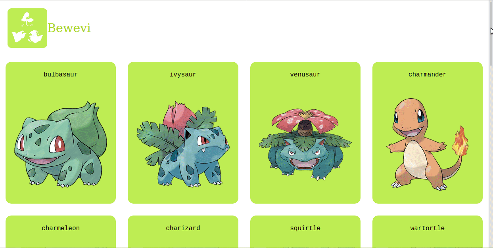

# Bewevi

This project was bootstrapped with [Create React App](https://github.com/facebook/create-react-app).
I developed a catalogue application to list pokemons. The project includes the basic features of
- Listing pokemons with general information
- Showing any pokemon with details

The app is using [PokéAPI](https://pokeapi.co/) as API

## Live Demo
[Live Demo](https://bewevi.ozovalihasan.com/)

## Presentation
You may watch [my presentation video](https://www.loom.com/share/9b274ece5ffa498998d6929c28c2407d)

## Getting Started

To get a local copy up and running follow these simple example steps.

### Prerequisites

Make sure Node.js is running on your local machine

## Setup

- Clone this repository
- Open terminal
- Change directory by using `cd bewevi`
- Run `npm install`

### Usage

- Run `npm start`
- Open a browser and go to http://localhost:3000

## Test app

- Clone this repository
- Open terminal
- Change directory by using `cd bewevi`
- Run `npm install`
- Run `npm test` to test all files

# Authors

Reach out to me at one of the following places!

👤 **Hasan Özovalı**

- Website: [ozovalihasan.com](ozovalihasan.com)
- LinkedIn: [Hasan Özovalı](https://www.linkedin.com/in/hasan-ozovali/)
- Github: [@ozovalihasan](https://github.com/ozovalihasan)
- Twitter: [@ozovalihasan](https://twitter.com/ozovalihasan)
- Mail: [ozovalihasan@gmail.com](ozovalihasan@gmail.com)

## 🤝 Contributing

Contributions, issues and feature requests are welcome!

Feel free to check the [issues page](issues/).

## Show your support

Give a ⭐️ if you like this project!

## Acknowledgments

Thanks to;

- [Microverse Inc](https://www.microverse.org/)
- Contributors of [pokeapi.co](https://pokeapi.co/)